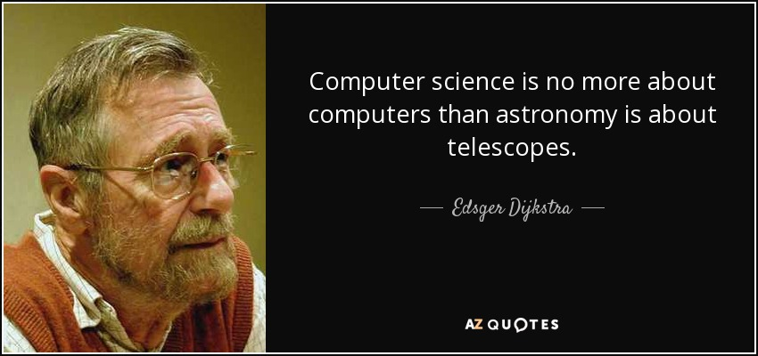

# [fit]SO YOU WANT TO PYTHON


--------------------------------------------------------------------------------

## what this talk will not be

- this talk will not be an exhaustive feature tour
- I will not teach you syntax
- you won't even be able to write python by the end of the talk

--------------------------------------------------------------------------------

## what I am looking to do

- I want to show you a few problems and how we solve them in python.
- I want to give you a few hooks so that you can get started with learning it , if you are interested.
- I want to expose you to the core principles and ideologies of python...
- and the general culture of python

--------------------------------------------------------------------------------

# [fit] import this?

--------------------------------------------------------------------------------

# THE ZEN OF PYTHON

- Beautiful is better than ugly.
- Explicit is better than implicit.
- Simple is better than complex.
- Complex is better than complicated.
- Flat is better than nested.
- Sparse is better than dense.
- Readability counts.
- Special cases aren't special enough to break the rules.
- Although practicality beats purity.
- Errors should never pass silently.
- Unless explicitly silenced.

--------------------------------------------------------------------------------

- In the face of ambiguity, refuse the temptation to guess.
- There should be one-- and preferably only one --obvious way to do it.
- Although that way may not be obvious at first.
- Now is better than never. Although never is often better than _right_ now.
- If the implementation is hard to explain, it's a bad idea.
- If the implementation is easy to explain, it may be a good idea.

--------------------------------------------------------------------------------

# [fit] quick survey


--------------------------------------------------------------------------------

# Meta

- There will be a gradual ramp in difficulty
- I will get geeky a few times
- Each problem will expose something new
- The idea is not to learn how to write python but understand what the point of this language is.
- there will be code but you don't have to understand it , just take away the ideology.

--------------------------------------------------------------------------------

## [fit] Exchanging 2 values

--------------------------------------------------------------------------------

### The C way

```c
int main() {
int a = 10,b = 20,temp;

temp = a;
a = b;
b = temp;
return 0;
}
```

--------------------------------------------------------------------------------

## isn't this hideous?

- An extra variable.
- Type declarations.
- Syntactic noise.

--------------------------------------------------------------------------------

# [fit] There must be a better way!

--------------------------------------------------------------------------------

> A high level language is one which doesn't require attention to the irrelevant.

--------------------------------------------------------------------------------

## let's look at the pythonic way to do things

<br><br>

```python
    x = 20 , y = 10
    x,y = y,x
```

<br>
<br>

READABILITY COUNTS , BEAUTIFUL IS BETTER THAN UGLY, SIMPLE IS BETTER THAN COMPLEX

--------------------------------------------------------------------------------

# Concept

- something that corresponds to a single unit of thought should be expressed in a single line , one logical step should be one LOC
- Readability counts a lot . Code is _READ_ a lot more than it is _WRITTEN_

--------------------------------------------------------------------------------

## lets take this idea for a spin

```python

def fib(n):
    x,y = 1,1
    for i in range(n-2):
        x,y = y,x+y
    return y
```

--------------------------------------------------------------------------------

- Good code should be easy to read and in a way self documenting.

- Good code makes its meaning clear.

--------------------------------------------------------------------------------

# [fit] reverse a string

--------------------------------------------------------------------------------

## The C way

```c
#include<stdio.h>
#include<string.h>

int main() {
   char str[100], temp;
   int i, j = 0;

   printf("\nEnter the string :");
   gets(str);

   i = 0;
   j = strlen(str) - 1;

   while (i < j) {
      temp = str[i];
      str[i] = str[j];
      str[j] = temp;
      i++;
      j--;
   }

   printf("\nReverse string is :%s", str);
   return (0);
}
```

--------------------------------------------------------------------------------

# [fit] There must be a better way!

--------------------------------------------------------------------------------

## the pythonic way

```python

s = “this”

print(s[::-1])
```

--------------------------------------------------------------------------------

# Concept

- Integrate powerful tools directly into the language
- Actively enforce good programming practices
- Higher level tools allow you to think on a more abstract level
- Learning to use the tools will be harder but you can be sure that they are the state of the art

--------------------------------------------------------------------------------

## lets take this idea out for a spin

<br>
<br>

```python
def pali(s):
    if s == s[::-1] :
        return True
    else: return False
```

--------------------------------------------------------------------------------

# [fit] easy things should be easy

--------------------------------------------------------------------------------

- programming isn't about solving small problems like this , instead it is about building systems and systematic solutions to problems...

- Problems much more complex than reversing a string...

- But all problems can be broken down into really small sub problems that rely on really simple pieces of code just like the one we saw.

- Not having to wrestle with the language allows us to think more clearly about the bigger picture.

--------------------------------------------------------------------------------

## let me show you what i mean.

```python
def pali(s):
    if s == s[::-1] :
        return True
    else: return False


with open('foo.txt') as f:
    rv = {i.strip() for i in f if pali(i.strip())}
    print(rv)
```

--------------------------------------------------------------------------------

- I just fed this code a list of ~497000 most common words on Reddit.
- It took me about 2 mins to write this code and about 10 mins to grab the words using PRAW.
- It ran in 0.2 seconds.

In just a fifth of a second i know the most common palindromes on Reddit.

--------------------------------------------------------------------------------


--------------------------------------------------------------------------------

## Python is a true high level language

- Build small things first and then combine them
- Python helps you out at every stage by giving you amazingly well designed tools.
- You shouldn't have to worry about the nitty-gritty.
- Works with you , it is amenable to various styles but not tied one.

  - functional, imperative, object oriented

--------------------------------------------------------------------------------

- True pythonic style allows you to _mix and match_ these styles , use what ever approach is the best for the problem at hand.

--------------------------------------------------------------------------------


--------------------------------------------------------------------------------

## Have no illusions

- Good tools does not equal good artist.
- It is arguable that higher level tools are really hard to understand and to gain mastery with.
- Python cannot make you a good programmer. A good Java programmer will still write superior code
- Truly beautiful python is more of an art than a science.

--------------------------------------------------------------------------------



--------------------------------------------------------------------------------

# [fit] with great power comes great responsibility.


--------------------------------------------------------------------------------

# [fit] Now for the fun stuff


--------------------------------------------------------------------------------

## the secret sauce of python

- The _amazing_ standard library
- The _amazing_ third party libraries
- And above all the _amazing_ community

--------------------------------------------------------------------------------

# let's send an email

```python
import smtplib

server = smtplib.SMTP('smtp.gmail.com', 587)
server.starttls()
server.login("fakeemail@fakecdf", "fakepass")

msg = " you know nothing jon snow "
server.sendmail("ygritte@wildling.com ", " jonsnow@kinginthenorth.com", msg)
server.quit()
```

That is all it takes to send an email with python (not really now gmail requires you to get an OAuth token. That is a few more lines)

--------------------------------------------------------------------------------

# let's write a program that writes the hello world program

```python
import time
import pyautogui as pag

#a small decorator that adds a 3 second countdown so that i can position my mouse
def withcountdown(func):
    def innerfunc(*args, **kwargs):
        for i in range(3)[::-1]:
            print(i+1)
            time.sleep(1)
        func(*args, **kwargs)
    return innerfunc

myfunc = withcountdown(pag.typewrite) # added a small time out to the pyautogui funciton

myfunc("def hw(times):\n\tprint('hello world'*times)")
```

--------------------------------------------------------------------------------

# Concept

- DRY. Extend the functionality of things already available at your disposal whenever you can.
- In this example i used a _Decorator_ to extend the functionality of _typewrite_.
- If it has already been written, it is not worth writing again.

--------------------------------------------------------------------------------

# doing awesome things is a lot more important than writing code


